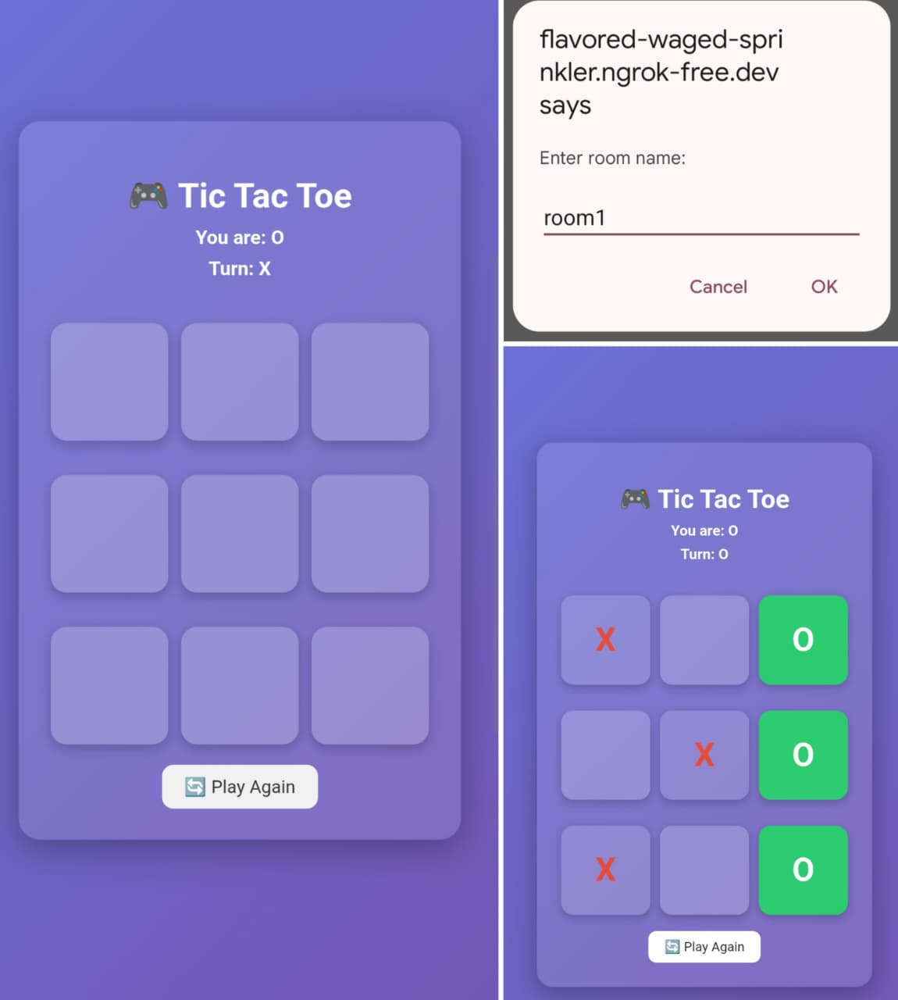

# 🎮 Multiplayer Tic Tac Toe

A real-time multiplayer Tic Tac Toe game built using Flask and Socket.IO.

## 🌟 Features
- Real-time gameplay
- Multiple rooms support
- Turn-based system
- Win & Draw detection
- Play Again option
- Winning highlight
- Scoreboard
- Beautiful UI

## 🛠 Tech Stack
- Python (Flask)
- Flask-SocketIO
- HTML, CSS, JavaScript

## 📸 Screenshot


## ▶️ Run Locally
```bash
pip install -r requirements.txt
python app.py

## 🌐 Live Demo
🔗 Play here: https://flavored-waged-sprinkler.ngrok-free.dev/

> ⚠️ Note: This is a temporary live demo (ngrok). The link works only while the server is running.


